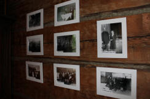
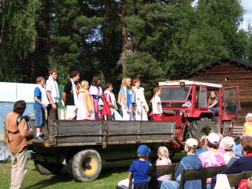

Teiskon Museon kokoelmiin kuuluu yli 2000 esinettä. Ne on suurimmaksi osaksi saatu lahjoituksina teiskolaisilta asukkailta ja eri tiloilta. Kokoelmat sisältävät maataloudessa käytettäviä työkaluja, keittiövälineistöä, huonekaluja, vaatteita sekä muita tekstiilejä. Myös kirjoja on runsaasti. Pytingissä on esillä asumiseen liittyvää tavaraa, kun taas piharakennuksissa on niihin kuuluvaa esineistöä. Ulkorakennuksissa on myös rekiä ja kärryjä ym. kunnostusta vaativaa tavaraa. Näistä omista kokoelmista muodostuu museon perusnäyttely.

Perusnäyttelyn lisäksi on museossa vuosittain vaihtuva teemanäyttely. Aikaisempina kesinä on museossa voinut ihastella mm. juhlia, hääteemaa, kastemekkoja, radioita, leluja, esiliinoja, koulutarvikkeita, pyyntivälineitä, kapineita kalsosta komiin, Lauri Erkiön lasinegatiiveja ja alusvaatteita.

[//]: # Anneriitta Lampisen kirjoittamat Teisko-Aitolahti -lehden artikkelit museoesineistä löydät täältä.

Museokokoelmia ovat koetelleet myös rosvot: sinne on murtauduttu kolme kertaa. Sen jälkeen museolle on hankittu pihatielle ajon estävä puomi ja sähköinen valvontalaitteisto.

Suurimman saaliin varkaat saivat seuran 50-juhlavuonna 2005, jolloin tavaraa katosi Lotta-merkistä päästävedettävään sänkyyn. Katso anastetut esineet täältä ja ilmoita osoitteeseen teisko.seura@teisko.fi, jos olet niitä nähnyt.

 

Perinteisesti museolla järjestetään monenlaisia tapahtumia. Esimerkiksi kesän 2002  teemana oli Tukkilaiset Teiskossa, jonka puitteissa järjestettiin tukkilaisesityksiä. Museolla sai tutustua tukkilaisperinteeseen ja kulkea metsässä jätkänpolkua pitkin ja istahtaa laavun alle lepäämään. Näytelmä- ja musiikki-illat sekä erilaiset perinne-esitykset ovat kesän vetonauloja. Teisko-Seuran juhlavuotena 2005 esitettiin museon pihalla musiikkinäytelmää Teiskon kesäjuhlat, joka oli niin suosittu, että esitykset jatkuivat myös kesällä 2006.  

   
Teiskon kesäjuhlat näytelmässä otettiin traktorikyytiä. Traktorin kyydissä laulavat Mikko Peuhkurinen (vas.) Veetrikki Hanhilahti, Vilho Pursiainen, Tekla Kylkilahti, Roosa Yli-Pietilä, Arttu Yli Pietilä, Henriika Tulivirta, Karoliina Sirpelä, Anna Kylkilahti ja Heini Nurmi. Ohjaamossa Henri Surakka ja Marleena Sirpelä. Säestäjänä Jari Leppänen. 

