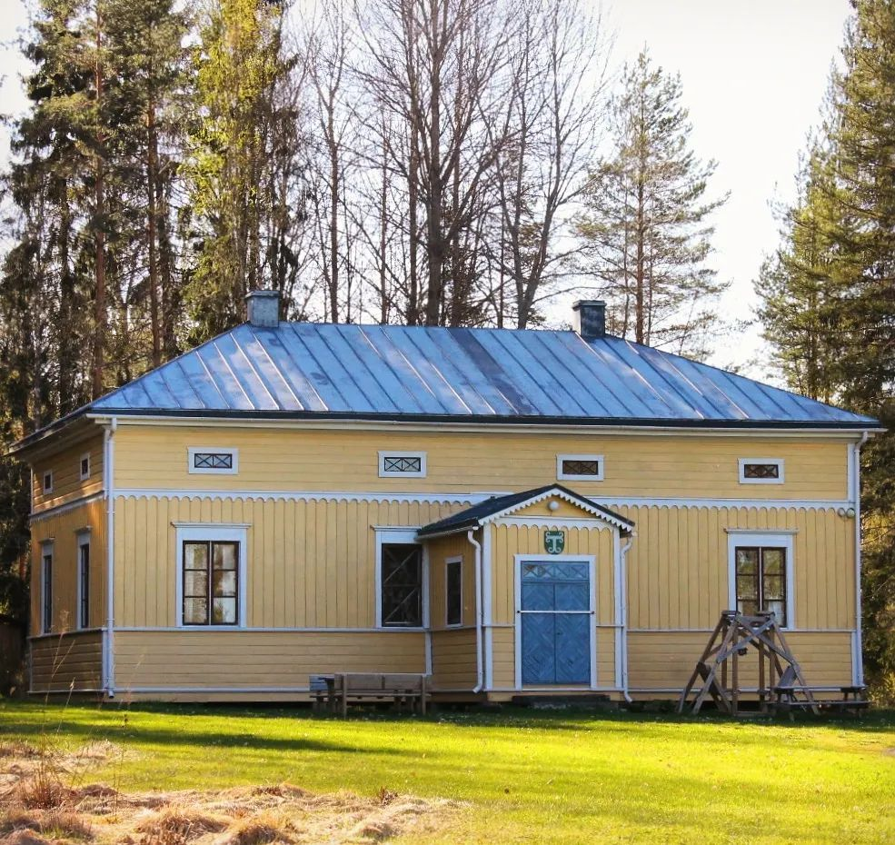
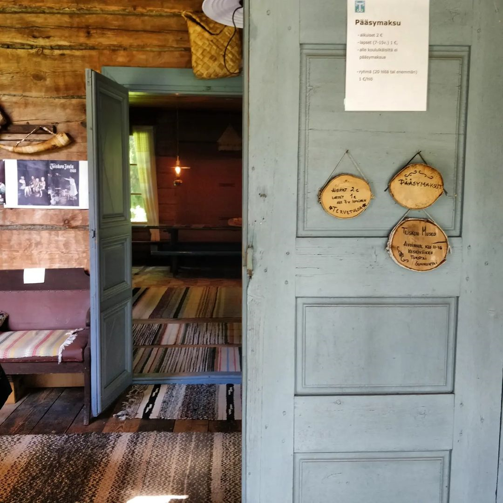

Museon päärakennus edustaa keskiaikaista, Italiasta lähtöisin olevaa rakennustyyliä, joka ajoittuu Kaarle-kuninkaiden aikaan. Sitä kutsuttiin karoliiniseksi tyyliksi.

Ruotsi-Suomessa sen malli vahvistettiin vuonna 1730 sotilasvirkatalojen ja rovastinpappiloiden vieraspytinkien tyyppipiirustukseksi. Toisinaan karoliinista tyyliä näkyi myös vauraissa talonpoikaistaloissa.
Museon päärakennus on valmistunut 1700-luvun loppupuolella. Se on oletettavasti siirretty Vähä-Kivirannasta Iso-Kivirannan tilalle vieraspytingiksi 1860. Museoalueelle se siirrettiin Iso-Kivirannan tilalta 1974, jonka jälkeen sitä entisöitiin, korjattiin ja maalattiin vuosina 1974–1975. Katto sai mustan värin 1976. seuraavan kerran rakennusta korjattiin ja maalattiin 2002, jolloin siihen tehtiin myös uusi ulko-ovi. Ovi maalattiin siniseksi 2006. Viimeisin julkisivuremontti korjauksineen ja maalauksineen tehtiin kesällä 2013.

Museon päärakennukseen käydään sisään valoisan kuistin sekä pitkän poikkisuuntaisen eteisen kautta. Suoraan edessä avautuu kaunis sali, jonka pitkän pöydän ääressä asukkaat ovat aterioineet. Pytingin molemmissa päissä on kaksi kamaria, joista toinen on käyttökeittiönä. Siellä on esillä kaikenlaista talouteen liittyvää tavaraa, astioita, isoja ja pieniä kuparipannuja, silitysrautoja jne.

Talon kolmessa kamarissa on jokaisella oma asukkaansa. Keittiön vieressä on vanhan emännän kamari, jossa emäntä on hyrisyttänyt rukkia, kuunnellut kidekoneella uutisia tai vaikka lueskellut illan hämyssä. Vanhan emännän kamarissa oleva uuni on valmistettu Länsi-Teiskossa, Hannun kylässä, olleen kaakelitehtaan kaakeleista.
Nuoren emännän kamarissa on nukutettu lasta kehdossa, peilailtu piirongin kauniista peilistä, tai järjestelty liinavaatteita kaappiin...
Isännän huoneessa ovat talon paperit pysyneet järjestyksessä mutta on siellä herraseurassa polteltu sikaria ja lueskeltu kirjallisuutta laidasta laitaan. Isännän kamarissa on piirongin päällä ihailtavissa viime sotien aikaisia taidokkaita puhdetöitä.

Museon esineet ovat lähes kaikki teiskolaisilta saatuja lahjoituksia. Jokaisella on oma, kiehtova tarinansa - jopa salissa olevalla saniaisella...
